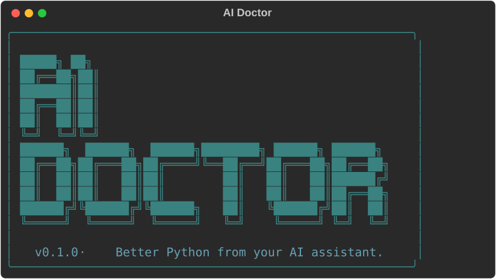

<p align="center">
  
</p>

> Your agent writes bad Python. This catches it.

A static analyzer for AI-generated Python code. Catches 25 patterns Claude Code, Cursor, Copilot, Codex, Gemini, and friends produce: bare `except`, hardcoded secrets, async/sync mismatch, dead defenses, fake type hints, stub comments shipped as production code. Then installs a skill into your agent so it stops writing them.

<details>
<summary><strong>See it in action</strong> (click to expand a full scan)</summary>

<p align="center">
  
</p>

</details>

[Install](#install) · [CLI](#cli) · [Rules](#what-it-catches) · [Leaderboard](#leaderboard) · [vs alternatives](#how-it-differs)

## Install

Install differs by harness. If you use more than one, install aidoctor separately for each.

> **Pre-PyPI note:** aidoctor v0.1.0 isn't on PyPI yet. Until it is, replace every `uvx aidoctor` and `pip install aidoctor` below with the git-source form:
>
> - `uvx --from git+https://github.com/ankit-aglawe/aidoctor aidoctor <args>`
> - `uv tool install git+https://github.com/ankit-aglawe/aidoctor`
> - `pip install git+https://github.com/ankit-aglawe/aidoctor`
>
> The Claude Code plugin install below works today regardless — it pulls straight from this repo.

### Claude Code

Register the marketplace and install the plugin:

```
/plugin marketplace add ankit-aglawe/aidoctor
/plugin install aidoctor@ankit-aglawe
```

After install, just talk to Claude in plain English. Three skills auto-load:

- **scan** — runs aidoctor, summarizes the top findings, asks before fixing
- **simplify** — three-angle review (reuse / quality / efficiency), then fixes
- **python-rules** — auto-loads when you write Python; your agent reads the 25 rules first

Slash forms `/aidoctor:scan` and `/aidoctor:simplify` work too.

### Cursor

In Cursor Agent chat:

```
/add-plugin aidoctor
```

Or run `uvx aidoctor install` once — it writes `~/.cursor/rules/aidoctor.mdc`.

### Codex CLI

Drop the rules file into Codex's config dir:

```bash
uvx aidoctor install
```

Writes `~/.codex/skills/aidoctor.md`. Codex reads it automatically when generating Python.

### Gemini CLI

```bash
uvx aidoctor install
```

Writes `~/.gemini/skills/aidoctor.md`.

### OpenCode

```bash
uvx aidoctor install
```

Writes `~/.config/opencode/rules/aidoctor.md`.

### Any other agent (Aider, Copilot, custom)

```bash
uvx aidoctor skill --format generic > my-agent/rules/aidoctor.md
```

Or paste this prompt into the agent:

> **Install aidoctor and run my first scan.**
>
> 1. Run `uvx aidoctor install` (or `pip install aidoctor && aidoctor install` if `uvx` is missing).
> 2. Run `uvx aidoctor scan .` in the current project.
> 3. Summarize in one paragraph: (a) the score out of 100 and its label, (b) the top 3 rule violations and what each means in plain English, (c) whether to fix errors or warnings first.
> 4. Do not modify any files. Stop after the summary.

## CLI

For humans and CI. Until aidoctor is published on PyPI, install from git:

```bash
# zero-install one-shot (works today, pre-PyPI)
uvx --from git+https://github.com/ankit-aglawe/aidoctor aidoctor scan .

# persistent install from git
uv tool install git+https://github.com/ankit-aglawe/aidoctor
pipx install git+https://github.com/ankit-aglawe/aidoctor
```

Once we publish to PyPI (next release), these shorten to `uvx aidoctor scan .` / `uv tool install aidoctor` / `pip install aidoctor`.

Then:

```bash
aidoctor scan .                       # full repo
aidoctor scan src/ tests/             # specific paths
aidoctor scan --diff                  # only lines you've changed
aidoctor scan-pr https://github.com/owner/repo/pull/42
aidoctor scan --explain bare-except-pass    # docs for one rule
```

No signup. No API key. No telemetry. Runs entirely on your machine.

## What it catches

25 rules across 8 categories. Each rule has a stable ID (`bare-except-pass`, `hardcoded-api-key`, `range-len-loop`) that appears identically in scan output, the skill markdown, and the slash command — so an agent can cite a finding back to you and you can cite a finding back to the agent.

| Category | Rules |
|---|---|
| **Dead defenses** | bare `except: pass`, `except Exception` swallowing, unreachable raise after return, redundant null-check after `isinstance` |
| **Hardcoded secrets** | API key / token literals, AWS credentials, JWT-shaped strings |
| **Async/sync mismatch** | sync I/O in async fn, `asyncio.run` inside async fn, blocking call in event loop |
| **Fake type hints** | `Any` everywhere, missing return type on public fn, generic without `TypeVar` |
| **Stale loop patterns** | mutate list during iteration, `range(len(x))`, `time.sleep` in tests |
| **Performance** | nested-loop `append`, `+=` string concat in loop, repeated dict lookup |
| **AI-slop imports** | wildcard import, duplicate import, conditional import outside try, import without use |
| **Comment-driven decay** | TODO/FIXME without ticket, stub comments (`# implement this`) shipped as code |

Full rule reference: `aidoctor scan --explain <rule-id>`.

## Score

`aidoctor scan` outputs a 0–100 health score. The score penalizes the *number of unique rules tripped*, not raw violation count — so fixing one category moves the number, instead of chasing per-line totals.

| Band | Label |
|---|---|
| 90–100 | Healthy |
| 70–89 | Needs work |
| 0–69 | Critical |

Same formula on every machine. Same formula in CI.

## Slash commands

In Claude Code, the plugin installs `/aidoctor:scan` (run a scan + summary). In OpenCode and Gemini CLI, `aidoctor install` drops a global `/aidoctor` command. Cursor and Codex don't support custom slash commands; the rules file is the install vector there.

## GitHub Action

```yaml
- uses: ankit-aglawe/aidoctor-action@v1
  with:
    fail-on: error      # error | warning | none
```

Or call the CLI directly in any workflow:

```yaml
- run: uvx aidoctor scan . --fail-on error
```

Pre-commit:

```yaml
repos:
  - repo: https://github.com/ankit-aglawe/aidoctor
    rev: v0.1.0
    hooks:
      - id: aidoctor
```

## Configuration

aidoctor reads `[tool.aidoctor]` in `pyproject.toml` if present. The defaults are designed to be useful without any config.

```toml
[tool.aidoctor]
exclude = ["migrations/", "vendor/"]
fail-on = "error"
```

### Inline suppression

```python
# aidoctor: disable=hardcoded-api-key
API_KEY = "sk-test-not-real"
```

Variants:

```python
foo()  # aidoctor: disable-line=range-len-loop
```

```python
# aidoctor: disable-file=stub-comment,todo-without-ticket
```

Multiple rules: `# aidoctor: disable=rule-1,rule-2`.

## How it differs

|  | aidoctor | Ruff | Sloppylint | CodeRabbit |
|---|---|---|---|---|
| Catches AI-author patterns specifically | ✓ | partial | ✓ | ✓ |
| Stable rule IDs | ✓ | ✓ | — | per-customer |
| Installs a skill in your agent | ✓ | — | — | — |
| Runs locally, no cloud | ✓ | ✓ | ✓ | — |
| Free CLI | ✓ | ✓ | ✓ | $24/seat/mo |
| Per-PR scan | ✓ (`scan-pr`) | via Action | — | ✓ |

Ruff is the right tool for correctness. aidoctor is the right tool for the specific failure modes LLMs have when they write Python — patterns that pass Ruff and mypy on default settings but break in production.

## Leaderboard

How major Python projects score:

| Repo | Score | Top issues |
|---|---|---|
| _coming at launch_ | — | — |

Want your project listed? [Open a PR](https://github.com/ankit-aglawe/aidoctor/pulls) adding it to `leaderboard.yaml`.

## Roadmap

- [x] Claude Code plugin via `/plugin marketplace add ankit-aglawe/aidoctor`
- [ ] Listed on the official Anthropic plugin marketplace
- [ ] MCP server (`aidoctor mcp`) so Cursor / Windsurf / Codex / Gemini reach the rules over a single transport
- [ ] `aidoctor learn` — propose project-local rules from your git history
- [ ] PR-delta scoring on GitHub Action

## Credits

Inspired by [react-doctor](https://github.com/millionco/react-doctor) by [@aidenybai](https://twitter.com/aidenybai). Built for the era where most Python isn't written by humans anymore.

## License

MIT
